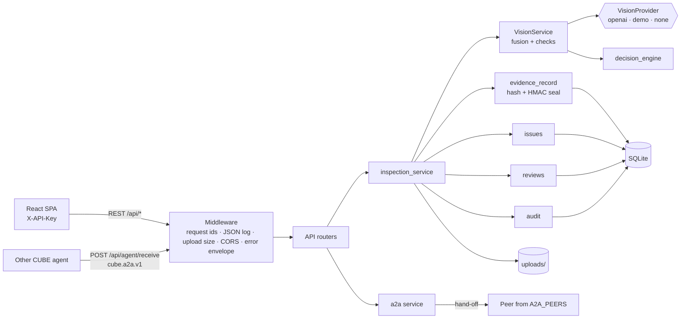

# Receiving Manager Architecture

## Overview

The backend is a FastAPI modular monolith on SQLite, and the frontend is a React 18 + Vite single-page app. A run gets structured observations from one perception call, optionally adds operator readings, and fuses each check across all photos. Deterministic Python rules then decide the verdict. Every run and every override appends a sealed, hash-chained `receiving_record.v1` version. REST (the UI) and A2A (other CUBE agents) share one service layer.



## Backend layers

### Entry point: `backend/app/main.py`

- Exception handlers turn every error into the unified envelope (`core/errors.py`).
- The `reject_oversized_uploads` middleware answers 413 before parsing when `POST /api/inspections/{id}/images` declares a `Content-Length` over `UPLOAD_MAX_IMAGES × MAX_IMAGE_SIZE_MB + 1 MiB`.
- `CORSMiddleware` allows the origins in `CORS_ALLOWED_ORIGINS`, with no credentials.
- `RequestContextMiddleware` is the outermost layer, so every response, including preflights and 413s, carries `X-Request-ID` and `X-Correlation-ID`.
- Routers: `system`, `agent`, `inspections`, `issues`, `reviews`, `evidence`, `catalogue`, `dashboard`, `audit`.

### API routers: `backend/app/api/`

| Module | Routes |
| --- | --- |
| `deps.py` | `require_principal` (API key → `{organization_id, operator_id, role}`), `Pagination`, `DateRange`, filter helpers |
| `system.py` | `/health`, `/ready` (also under `/api`), `/api/system/info` |
| `inspections.py` | list / create / get, image upload and download, `run` (alias `analyze`), `review`, `override`, `notes`, `handoff`, `verify`, `export`, `audit` |
| `issues.py`, `reviews.py` | exception and review-queue lifecycles |
| `evidence.py` | uploaded images as evidence files |
| `catalogue.py` | products, purchase orders, CSV / sample import, derived shipments and cartons |
| `dashboard.py`, `audit.py` | aggregates and the audit log |
| `agent.py` | `/.well-known/agent.json`, `/api/agent/capabilities`, `/api/agent/receive`, `/api/agent/activity` |

Routers are thin: validation is done by Pydantic models (mostly `extra="forbid"`), and the work happens in services.

### Services: `backend/app/services/`

| Module | Responsibility |
| --- | --- |
| `inspection_service.py` | Transport-independent workflow: create, `store_images` (all-or-nothing), `run_inspection`, `override`, `verify`, notes, views. Holds the per-inspection `threading.Lock`. |
| `vision_providers.py` | `VisionProvider` interface (`name`, `model`, `available()`, `analyze()`), with `OpenAICompatibleProvider`, `DemoScenarioProvider` and `UnavailableProvider`. `select_provider()` applies `VISION_PROVIDER`. |
| `vision.py` | `VisionService`: response schema and prompt, payload validation, operator readings, multi-photo fusion, check construction, `pending_result()` when perception is unavailable. |
| `evidence_record.py` | Builds `receiving_record.v1` (and override versions), canonical hash, HMAC seal, seal verification. |
| `issues.py`, `reviews.py` | Issue and review-task creation, supersession and transitions after each run. |
| `audit.py` | `record_event()`: one append-only audit row per mutation. |
| `uploads.py`, `storage.py` | Image validation (multipart and base64), and inspection-scoped local file storage. |
| `a2a.py` | Agent card, envelope parsing, idempotent inbound processing, outbound hand-off, activity log. |
| `catalogue.py`, `dashboard.py`, `exports.py`, `health.py` | Catalogue and derived views, dashboard aggregates, JSON / CSV / HTML export, liveness and readiness. |

### Core: `backend/app/core/`

- `config.py`: `Settings`, read from the environment and the repo-root `.env`.
- `decision_engine.py`: the per-check rules, `apply_damage_policy`, `evaluate_carton_condition_check` and `evaluate_overall`. See [DECISION_LOGIC.md](DECISION_LOGIC.md).
- `context.py`: context variables for the request id, correlation id, operator and channel (`api` / `a2a`). `clean_id()` accepts client ids only if they match `[A-Za-z0-9._:-]{1,128}`.
- `observability.py`: `RequestContextMiddleware` (pure ASGI) and the JSON log formatter. It writes one access line per request with `ts, level, logger, request_id, correlation_id, method, path, status, latency_ms, operator_id`.
- `errors.py`: `AppError` and handlers. Every non-2xx body is `{"detail": str, "error": {code, message, request_id, details}}`. Unhandled exceptions are logged and answered as `500 INTERNAL_ERROR` without a stack trace.

### Models: `backend/app/models/`

- `po.py`: `PurchaseOrder`.
- `intake.py`: `Shipment`, `Carton`, `ManualObservations`.
- `inspection.py`: `Inspection`, `ReceivingImage`, `InspectionCheck`, `VisualObservation`.
- `evidence.py`: `Evidence`, one reading tied to an image, or to `"operator"`.

## Data flow of a run

`POST /api/inspections/{id}/run`, or `receiving.inspect` over A2A, which first creates the inspection and stores the base64 images:

1. **Lock and load.** Take the per-inspection lock and load the inspection scoped to the caller's organisation. If the body contains `manual_observations`, it replaces the stored operator readings (an empty object clears them). No images and no operator readings gives 400.
2. **Perception.** `select_provider()` picks `openai`, `demo` or `none`.
   - `openai` sends the prompt plus each image (as `image_id` / view / data URL) to the Responses API with a strict JSON schema. The model is not told the PO values, so it reads blind.
   - `demo` returns scripted readings for the chosen scenario, attached to the first uploaded image.
   - `none` raises `VisionUnavailable`.
   - The payload is re-validated with Pydantic, and unknown, duplicate or reserved (`operator`) image ids are rejected.
3. **Fallback.** Any perception exception is caught (fail open).
   - With operator readings, the run is decided from the operator readings alone. Checks with no operator reading become `UNCERTAIN` / `PERCEPTION_UNAVAILABLE`.
   - Without operator readings, `pending_result()` sets every perception check to `UNCERTAIN` and the verdict to `PENDING_REVIEW`. The carton-condition check is still evaluated.
4. **Fusion and rules.** Operator readings are added as a synthetic image `operator` (confidence 1.0). Each check is fused across photos, decided by `decision_engine`, and `evaluate_overall` yields PASS / EXCEPTION / UNCERTAIN.
5. **Persist.** The inspection's working state (checks, evidence, observations, summary, status) is updated. Then `append_record` writes the next sealed record version inside `BEGIN IMMEDIATE`, with the `perception` and `intake` extensions.
6. **Follow-ups.** Previous open issues are superseded and one issue is opened per FAIL / UNCERTAIN check. A review task is opened, refreshed or cancelled. An `inspection.run` audit event is written.
7. **Response.** The response carries `decision` (contract value), `verdict` (PASS / FAIL / UNCERTAIN), `analysis_status` (`complete` / `demo` / `operator_only` / `pending_review`), `vision_status`, checks, evidence, issues, review task and the sealed record.

Overrides (`/override`, or a review decision) take the same lock and append a new sealed version through `append_override`. That version copies the checks unchanged, changes `outcome`, and appends to `overrides[]`. They also write a row to the `overrides` table. `/verify` re-checks every version.

## Persistence (SQLite, `database/repository.py`)

| Table | Kind | Contents |
| --- | --- | --- |
| `inspections` | mutable | Working state of each inspection as JSON, without `record`. On read, the latest record is loaded to set `record`, `overrides`, `final_decision` and `prep_hold`. |
| `records` | append-only (triggers abort UPDATE / DELETE) | Every sealed record version: `record_id, inspection_id, organization_id, version, record_json, content_hash, created_at`, with `UNIQUE (inspection_id, version)`. |
| `overrides` | append-only (triggers) | `override_id, operator_id, role, from_verdict, to_verdict, reason, before_hash, after_hash, …` |
| `audit_events` | append-only (triggers) | One event per mutation. |
| `issues`, `review_tasks`, `agent_activity`, `products`, `purchase_orders`, `notes` | mutable JSON documents | Columns `organization_id, id, inspection_id, status, kind, ref, idem, created_at, updated_at, data`, with indexes on `(organization_id, created_at / inspection_id / ref)` and a unique `(organization_id, idem)` used for A2A idempotency. |

- The schema is created idempotently on first connection, and WAL mode is enabled.
- Every query is filtered by `organization_id`.
- Shipments and cartons are not tables. They are derived from inspections on each request. Purchase orders combine stored rows with POs seen only on inspections (`source: "inspections"`).
- Photos are stored at `UPLOAD_ROOT_DIR/inspections/<inspection_id>/<uuid>_<inspection_id>.<ext>`.

## Record (`receiving_record.v1`)

These are the fields the code writes:

- **Identity and chain:** `record_id`, `schema_version`, `organization_id`, `inspection_id`, `version`, `supersedes{record_id, content_hash}`.
- **Subject:** `subject{unit_id, sku, asin, po_number, po_line}`.
- **Images:** `images[{image_id, view, sha256_digest}]`.
- **Checks:** `checks[{check_key, check_name, verdict, observed_state, expected_state, reason_code, reason, measurements, image_ids, evidence_ids, model_version, rule_ids}]`.
- **Outcome:** `outcome{verdict, decision, disposition, prep_hold, hold_reasons, failure_reason}`.
- **Overrides:** `overrides[]`.
- **Status:** `status` (`final` / `pending`), `stage` (`analyzed` / `pending_review` / `overridden`), `analyzed_by`, `created_at`.
- **Seal:** `seal_key_id` (`env` / `ephemeral`), `seal_key_ref`, `content_hash`, `seal`.
- **Extensions:** `perception{vision_provider, vision_status, vision_failure_reason, operator_observations, damage_policy}` and `intake{shipment, cartons}`.

The `carton_condition` check key is a contract extension. Sealing is described in [SECURITY.md](SECURITY.md).

## A2A flow

```text
Agent A                             Receiving Manager
  | GET /.well-known/agent.json  ->  agent card (operations, auth, status)          [public]
  | POST /api/agent/receive      ->  require_principal (X-API-Key, role agent)
  |   envelope cube.a2a.v1           parse_envelope (version, message_id, sender, operation, recipient)
  |                                  idempotency: (org, sender.agent_id|message_id) -> stored response replayed
  |                                  handler: receiving.inspect | get_record | verify_record | agent.ping
  |                                    inspect = validate base64 images -> create -> store_images -> run_inspection
  |                                  activity row (image bytes stripped) + audit event a2a.received
  | <- response envelope (HTTP 200, status completed|failed, error{code,...})
  |
  | (later, from the UI) POST /api/inspections/{id}/handoff {target_agent}
  |                                  receiving.record_available envelope with the latest record
  |                                  -> POST to A2A_PEERS[target] (10 s) => delivered | failed
  |                                  -> no peer configured            => not_configured (envelope stored)
```

Protocol problems are answered as `status: "failed"` envelopes with HTTP 200. Only authentication (401 / 503) and oversize bodies (413, envelope limit 64 MiB) are transport errors. Details are in [docs/A2A.md](docs/A2A.md).

## Frontend architecture (`frontend/src/`)

- **Shell.** `App.jsx` mounts the providers. It renders the landing page at `#/`, or `components/AppShell.jsx` at `#/app/…`. The shell includes the sidebar from `NAV_SECTIONS` with badge counts, the topbar with the API-key panel, the mobile drawer and a per-page error boundary.
- **Router.** `lib/router.js` is a small hash router (`useRoute`, `navigate`, `pathFor`, `setQuery`, aliases such as `issues → exceptions`). `routes.js` is the single route table: page key → list / detail component.
- **State.** `context/AppContext.jsx` holds the API key (localStorage), connection state, principal, `systemInfo`, `/ready`, sidebar counts and the theme.
- **API client.** `services/api.js` has one function per endpoint and throws `ApiError` (`status`, `code`, `requestId`, `details`). The base URL is `VITE_API_BASE_URL`; otherwise the dev server uses `http://localhost:8000` and production builds use the same origin.
- **Data hooks.** `hooks/useAsync.js` provides `useApi`, which waits for a key, refetches on reconnect and keeps the previous data while reloading.
- **Component kit.** `components/ui/` contains PageHeader, Card, StatCard, DataTable, Pagination, FilterBar, badges, Modal / ConfirmDialog, toasts, AsyncButton, empty / error / loading states, Tabs, JsonViewer, FileDropzone, Timeline and VerdictChart.
- **Pages.** `pages/` has one file per page, all lazy-loaded with `React.lazy` (one chunk each). Larger pages keep helpers in subfolders: `pages/inspection/` (wizard steps, detail tabs and actions, intake validation), `pages/review/` (review components and helpers) and `pages/ops/` (A2A console, guided demo, agent card, scenario regression, catalogue forms).

Page-builder details are in `frontend/src/README.md`.

## Deployment shapes

- **Docker:** the backend image is `python:3.12-slim` running `uvicorn` on `$PORT`. The frontend image is a Node 22 build served by nginx.
- **Render:** the `render.yaml` Blueprint defines a Docker API service and a static site.
- **Vercel:** `vercel.json` builds the static frontend and runs `api/index.py` as one Python function. The function's database and uploads go to `/tmp`, which is ephemeral.

## Known architectural limits

- The inspection and idempotency locks are per process. Several workers need a database-level guard.
- SQLite with application-level tenancy. List endpoints filter in Python over all of an organisation's rows.
- The live model call is tested only with a mocked client, and there is one global confidence threshold (0.6).
